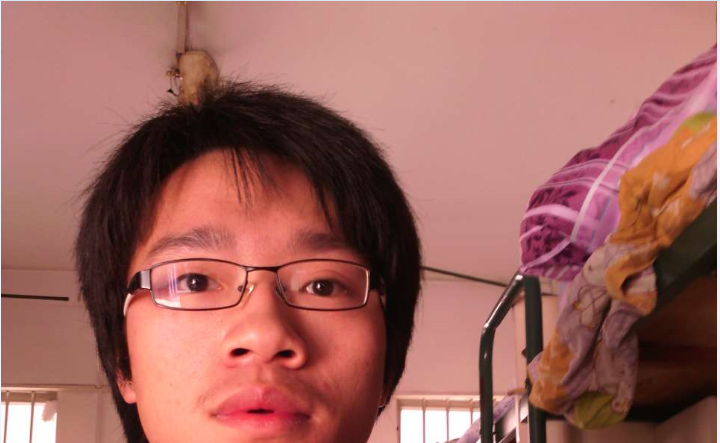
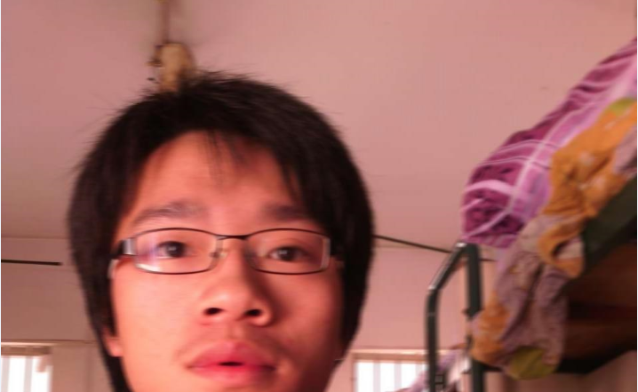
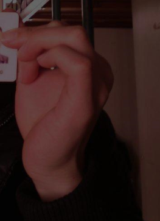
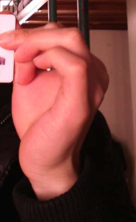
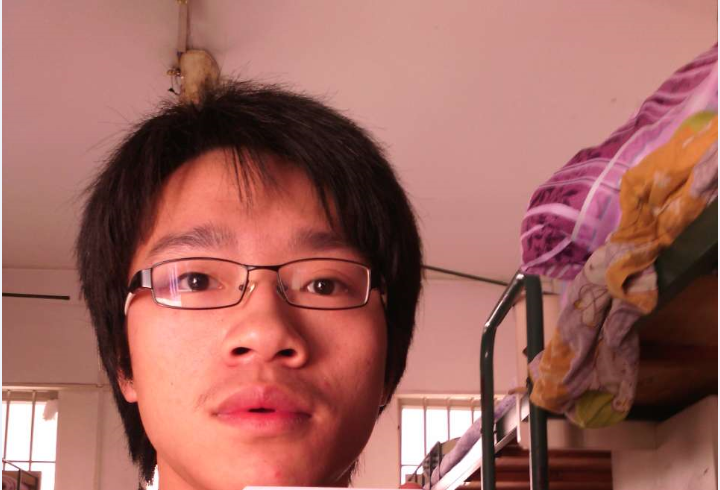

# wxpython 的笔记

## 图像id

这个只能通过图像加入（add）`ImageList`时获得。控件需要拥有一个`ImageList`（AssignImageList）。

#### 关键字

`ImageList` `Image` `index` `AssignImageList` `WithImages`  `Alpha Channel`

#### 例子

```python
import os

import wx

path = "test.jpg"
image = wx.Image(path)

class ToolBook(wx.Toolbook):
    u"""此处应有文档
    """
    def __init__(self, parent, id, style=wx.TB_BOTTOM):
        super(ToolBook, self).__init__(parent, id, style)

        imagelist = wx.ImageList(75, 75) # (weight, height)

        index_1 = imagelist.Add(wx.Image(path_1).ConvertToBitmap())
        index_2 = imagelist.Add(wx.Image(path_2).ConvertToBitmap()) 
        index_3 = imagelist.Add(wx.Image(path_3).ConvertToBitmap()) 

        self.AssignImageList(imagelist)

        p = wx.Panel(self, -1)
        win = ColorPanel.ColoredPanel(p, "red")
        p.win = win
        self.AddPage(p, "string", index_1)
        self.AddPage(p, "string", index_2)
        self.AddPage(p, "string", index_3)

        # 事件处理
        self.Bind(wx.EVT_TOOLBOOK_PAGE_CHANGED, self.OnPageChanged)
        self.Bind(wx.EVT_TOOLBOOK_PAGE_CHANGING, self.OnPageChanging)

    def OnPageChanged(self, event):
        old = event.GetOldSelection()
        new = event.GetNewSelection()
        sel = self.GetSelection()

    def OnPageChanging(self, event):
        old = event.GetOldSelection()
        new = event.GetNewSelection()
        sel = self.GetSelection()

```
#### ImageList

- 初始化时需要指定图像的大小，一般来说二维的大小都是（宽， 高）。`mask`用于`transparent drawing`。

`ImageList(width, height, mask=True, initialCount=1)`

- 以列表的形式储存图像，储存形式没有指定。可以包含`bitmap`和`icon`两种格式。`icon`只能在`MSW`和`MAC OS`上能用。

- `ListCtrl`和`TreeCtrl`有关。

使用`Add(bitmap, mask=True)`会返回添加图像在`ImageList`中的索引。原图像并不会被被这里的操作所影响。
如果`bitmap`比规定的尺寸要大的话，会被切割成符合规定的。`icon`则不会。

	add()

##### WithImages

是一个`mixin`类，用于使用`ImageList`的其他类。为其他类使用`ImageList`做准备。

子类有`BookCtrlBase`。

有三个重要的方法：

- `AssignImageList(self, ImageList)`:为`Page Control`设置ImageList并且移交所有权给它（垃圾回收）。 
- `SetImageList(self, ImageList)`:设置但不移交所有权，需要自己删除列表。
- `GetImageList(self)`:返回关联的ImageList，没有则为`None`。

#### wx.Image 与 wx.Bitmap 的区别

wx.Image是用来执行各种操作的，例如：剪切、旋转、缩放等。与平台无关。暂时不可以画在设备上下文上。

wx.Bitmap可以简单快速的画在各种设备上下文上。

```python
```

## `Mixin`是什么意思？

面向对象语言里的一个编程概念，用于给其他类提供额外的功能而不增加其负担。向其他类注入代码。

以父类的方式只提供功能，不创建隔离，特殊化。

- 给多个不同类别的类添加相同的功能。
- 代码重用
- 以组合的方式创建类

<a target="blank" href="https://en.wikipedia.org/wiki/Mixin">维基百科</a>

#### 常见问题

Python类的多重继承，使得`mixin`的创建成为可能。Python的继承方式是<i style="color:red">从右到左</i>，左面的方法会覆盖右边的。不注意就会出错。

从右到左意味着最右边的类是基类，左边的类是用来给他提供扩展的。

```python
class Mixin1(object):
	def some_functions():
		print u"Mixin1 exist to extend main class"

class Mixin2(object):
	def some_functions():
		print u"Mixin2 exist to extend main class"

class BaseClass(object):
	def main_functions():
		print u"Main function"

class MoreFunction(Mixin2, Mixin1, BaseClass): # 专业的BaseClass在最右边
	def addition_function():
		print "addtion function"
```
<a target="blank" href="https://www.ianlewis.org/en/mixins-and-python">来自：www.ianlewis.org</a>

## wx.Toolbook

## 图像处理中的`mask` `Alpha Channel`是什么意思？

wx.Image 支持`PNG` `TGA` `TIFF`三种格式图像的Alpha Channel

## wx.Image

GIF, ICO and TIFF 一个文件可能包含多张图片，需要指定图片的索引。

### 创建 保存

```python
# 从文件
image = wx.Image("path/to/image")
# 从流
img = wx.Image(stream, type=BITMAP_TYPE_ANY, index=-1)

# 保存
image.SaveFile(name, type) # name 是文件名包含路径 c://wx/abc.jpg 可以不指定type
image.SaveFile(stream, type) # 保存到输出流 type必须指定
```

#### 支持图像格式 type的值

|格式|type值|备注|
|----|---|----|
||wx.BITMAP_TYPE_INVALID	 ||
|bmp|wx.BITMAP_TYPE_BMP	 ||
|ico|wx.BITMAP_TYPE_ICO	 ||
|cur|wx.BITMAP_TYPE_CUR	 |Windows鼠标文件|
|xbm|wx.BITMAP_TYPE_XBM	 ||
|xbm_data|wx.BITMAP_TYPE_XBM_DATA	 ||
|xpm|wx.BITMAP_TYPE_XPM	 ||
|xpm_data|wx.BITMAP_TYPE_XPM_DATA	 ||
|tiff|wx.BITMAP_TYPE_TIFF	 ||
|tif|wx.BITMAP_TYPE_TIF	 ||
|gif|wx.BITMAP_TYPE_GIF	 ||
|png|wx.BITMAP_TYPE_PNG	 ||
|jpeg|wx.BITMAP_TYPE_JPEG	 ||
|pnm|wx.BITMAP_TYPE_PNM	 ||
|pcx|wx.BITMAP_TYPE_PCX	 ||
|pict|wx.BITMAP_TYPE_PICT	 ||
|icon|wx.BITMAP_TYPE_ICON	 |使用SaveFile时储存的是Windows的图标文件|
|ani|wx.BITMAP_TYPE_ANI	 |Windows Animated cursor file|
|iff|wx.BITMAP_TYPE_IFF	 ||
|tga|wx.BITMAP_TYPE_TGA	 ||
|mac cursor|wx.BITMAP_TYPE_MACCURSOR	 ||
|any|wx.BITMAP_TYPE_ANY|自动检测格式|

### 大小尺寸处理

`Copy` `Create` `Destroy` `Mirror`  `Paste` `Rescale` `Scale` `Resize` `Rotate` `Rotate180` `Rotate90` `RotateHue` 

#### 缩放

`Scale` `Rescale` `Resize`

##### 缩放图片质量控制

|代码|描述|
|---|---|
|wx.IMAGE_QUALITY_NEAREST|简单最快的|
|wx.IMAGE_QUALITY_BLINEAR|前后两个的折中|
|wx.IMAGE_QUALITY_BICUBIC|最高质量，最低运行速度|
|wx.IMAGE_QUALITY_BOX_AVERAGE|周围的像素取平均值|
|wx.IMAGE_QUALITY_NORAML|默认的算法|
|wx.IMAGE_QUALITY_HIGH|最佳的算法|


#### 裁剪

`Paste` `GetSubImage`

#### 旋转

`Rotate`

### 色彩处理

`Replace` 

### 像素处理

`monochrome`:单

`black`:黑色

`white`:白色


#### 模糊 blur

`Blur(self, blurRadius)` 半径以像素（pixel）为单位，进行垂直、水平方向模糊处理。

</img>
</img>
</img>

`BlurHorizontal(self, BlurRadius)`只在水平方向进行。

</img>
</img>
</img>


`BlurVertical(self, blurRadius)` 只在垂直方向进行。

</img>
</img>
</img>

#### 转换成 Bitmap

	ConvertToBitmap(self, depth=-1)

#### 调整亮度

	ConvertToDisabled(self, brightness=255)

转换后</img> 
原图</img>

#### 调整灰阶（Greyscale）

	ConvertToGreyscale(self)
	ConvertToGreyscale(self, weight_r, weight_g, weight_b)

</img>
</img>

#### 单色图像(mono:单)

图像中的`(r, g, b)`变成白色。其他变为黑色。

	ConvertToMono(self, r, g, b)
	ConvertToMonoBitmap(self, r, g, b)

</img>
</img>


## ID 相关

wx.NewId()

wx.ANYID

wx.

## Sizer Layout

- 添加进Sizer的东西叫`item`。
- 如果一个Sizer既不属于另一个Sizer,也不属于一个窗口（window）那么你就需要手动删除它。（orphan sizer）

#### flag 

flag有两种，一种是决定border的应用的地方，另一种是当Sizer的空间发生变化时决定空间如何分配给item。

|flag|作用|||flag|作用|
|----|----|||----|---|
|wx.TOP|Border的方向|||wx.ALIGN_CENTER|item在分配空间中的排列|
|wx.BOTTOM||||wx.ALIGN_LEFT||
|wx.RIGHT||||wx.ALIGN_RIGHT||
|wx.LFET||||wx.ALIGN_TOP||
|wx.ALL||||wx.ALIGN_BOTTOM||
|||||wx.ALIGN_CENTER_VERTICAL||

|||
|----|----|
|wx.ALIGN_CENTER_HORIZONTAL||
|wx.EXPAND|占据全部空间|
|wx.SHAPE|扩张但保持比例|
|wx.FIXED_MINSIZE|固定最小尺寸|
|wx.RESERVE_SPACE_EVEN_IF_HIDDEN|分配空间给看不见的window|

#### 组合flag

`|`:样式组合

`^`:样式删除

`&`:样式取反？

`~`: 


#### Python bitwise

|operator|例子|说明|
|----|----|----|
|`<<`|x << y|Shift等同于 x* 2**y|
|`>>`|x >> y|等同于 x/ 2**y|

` |`  `x | y` bitwise OR  x、y的每一位`或`运算结果为0则输出为0，否则为1。

|||
|---|---|---|
|`&`||bitwise AND x、y的每一位`与`运算结果为1输出1，否则为0|
|`~`|~ x|按位取反，等同于 -x-1|
|`^`| x ^ y |bitwise XOR 异或 y位为0对应的x该位不变，y位为1时，对应x的位取反|


### BoxSizer

    Add(self, item, proportion, flag, border, userData)

proportion 是BoxSizer排列方向上的比例，默认是0，意味着用该方向上的最小宽度（高度）。

flag：wx.EXPAND是指定在BoxSizer的反方向上扩展,占据全部空间。

### 使用AddMany添加 空白空间 间隙

    Sizer.AddMany([(width, height, flag)])

#### Sizer动态添加，删除项目

`Clear` `Remove` `Detach`

### GridSizer

表格的每一格都是同样的高、宽。宽高都有最高的一个包含物决定。

### StaticBoxSizer

比BoxSizer多一个边框。

### FlexGridSizer

以表格的方式排列，只要求同一行的格子有相同的高，同一的有相同的宽。

### GridBagSizer

大致和FlexGridSizer差不多，可以在Sizer的指定位置放置控件。一个控件可以占据一行（列）或者多行（列）空间

    Add(window, pos, span=wx.DefaultSpan, flag=0, border=0, userData=None)
    pos=(row, col)

### WrapSizer

动态调整内容的排列，

### PySizer

## panel 动态更新

问题：

使用SetSizer后再调用`Add(item)`和 `sizer.Layout()`显示不正常？

场景：

    class Panel(wx.Panel):
        def __init__(self, parent):
            super(Panel, self).__init__(parent)

            self.sizer = wx.BoxSizer()
            self.SetSizer(self.sizer)
            
            self.DynamicUpdate()
        
        def DynamicUpdate(self):
            control = wx.StaticText(self, label=u"长文本")
            self.sizer.Add(control, 0, wx.EXPAND)
            self.Layout()

解决办法：

    self.sizer.Layout()
    self.GetParent().Layout()

为什么？：


## ToggleButton 开关按钮

- 开关按钮的状态分为两种，按下是True 不按是False。
- 可以禁止按钮，会保持按钮当前的状态。 禁止后就不会产生事件。
- 事件处理器是： wx.EVT_TOGGLEBUTTON


```python
button = wx.ToggleButton(parent, id=ID_ANY, label="", 
                        pos=wx.DefaultPosition,size=wx.DefaultSize,
                        style=0, val=wx.DefaultValidator, 
                        name=CheckBoxNameStr)

button.GetValue()
button.SetValue()

button.Disable()
button.Enable()
```


## event 处理

- 禁止后就不会产生事件。

```python
def OnEvent(self, event):
    obj = event.GetEventObject()
    obj_id = event.GetId()
    do something
```

- 事件传播 propagation

Veto: 禁止传播

Skip: 继续传播

## 动态更新

&emsp;&emsp;点击按钮后重新绘制面板的内容。

    Fit FitInside Layout SetAutoLayout GetAutoLayout SetSizer GetSizer Raise Refresh Update

    z-index 

### 方案一 Hide Show

`.Hide()` `.Show()`

&emsp;&emsp;全部添加进一个Sizer，之后使用Hide或者Show响应按钮切换。

优点：

- 切换时不会重新绘制图形
- 只需使用这两种方法即可

疑问：

- 使用Hide后下面的控件会自动显示在当前面板吗？
    
    不会

- 需要手动更新面板吗？（Refresh、Layout、Update
    + 需要，调用Layout即可。


- Layout的调用在哪个类上进行？（frame、Panel、Sizer）
    + 父类上调用Layout方法即可。`self.GetParent().Layout()`
- 什么时候要这样子？
```python
        self.SetSizer(sizer)
        sizer.Fit(self)
```
- 消除闪烁？
```python
    self.st.Freeze() 
    self.st.SetLabel(self._label) 
    self.st.Wrap(self.GetSize().width) 
    self.st.Thaw()
```

新知识：

- panel 只有一个widget也需要使用Sizer，frame不用
 

来源：<a href="http://wxpython.org/Phoenix/docs/html/sizers_overview.html#hiding-controls-using-sizers" target="blank">官方文档hiding-controls-using-sizers</a>

#### 结果

```python
class SelectPanel(wx.Panel):
    u"""不显示具体内容
    """

    def __init__(self, parent, name):
        super(SelectPanel, self).__init__(
            parent, size=(900, 400), name=name)
        self.vsizer = wx.BoxSizer(wx.VERTICAL)
        
        self.vsizer.Add(TimeSelectPanel(self, u"time_select_panel"), 1, wx.ALIGN_CENTER_HORIZONTAL, 5)
        self.vsizer.Add(CourseSelectPanel(self, u"course_select_panel"), 1, wx.ALIGN_CENTER_HORIZONTAL, 5)
        self.vsizer.Add(TeacherSelectPanel(self, u"teacher_select_panel"), 1, wx.ALIGN_CENTER_HORIZONTAL, 5)
        
        wx.FindWindowByName(u"course_select_panel").Hide()
        wx.FindWindowByName(u"teacher_select_panel").Hide()

        self.SetSizer(self.vsizer)


    def change_content(self, panel_name):
        widget_names = [u"course_select_panel", u"time_select_panel", u"teacher_select_panel"]
        for widget_name in widget_names:
            if widget_name == panel_name:
                wx.FindWindowByName(widget_name).Show()
                self.GetParent().Layout()
            else:
                self.vsizer.Hide(wx.FindWindowByName(widget_name))
               
                #wx.FindWindowByName(widget_name).Hide()
                #self.vsizer.Layout()
                self.GetParent().Layout()
```

### 方案二 Dynamic add and delete widgets to Sizer

widget /ˈwɪdʒɪt/

    Sizer Detach Destroy Remove Replace Add Insert Prepend

创建好widget后调用parent或者Sizer的Layout方法。可能也需要调用Fit.

来源：<a href="http://www.blog.pythonlibrary.org/2012/05/05/wxpython-adding-and-removing-widgets-dynamically/" target="blank">http://www.blog.pythonlibrary.org</a>

## PopupMenu 

&emsp;&emsp;每一个窗口都有一个方法  

## Grid

改变label：

SetColLabelValue SetRowLabelValue 

EnableEditing(False) DisableColResize(self, col) DisableDragColMove() DisableDragColSize DisableDragGridSize DisableDragRowSize  DisableRowResize

### 表格大小拉伸

DisableDragGridSize() # 禁止在网格区缩放表格
DisableDragRowSize()  # 禁止在行标题区拉伸表格
DisableDragColSize()  # 禁止在列标题区拉伸网格

### 表格大小设定

SetColSize SetRowSize SetDefaultRowSize(height) SetDefaultColSize(width)

### 多选

#### 自己实现

    grid.SetCellBackgroundColour(row, col, colour)
    grid.Refresh()

左键单击改变背景色，取消原来的选择

    SetSelectionMode
    wx.grid.Grid.wxGridSelectCells
    wx.grid.Grid.wxGridSelectRows
    wx.grid.Grid.wxGridSelectColumns

    SetSelectionBackground SetSelectionForeground SetGridLineColour SetLabelBackgroundColour SetLabelTextColour SetMargins

    SetCellHighlightPenWidth(0)

###### 禁止行、列选择

style无法解决这个问题，保持单个表格选择的同时只能禁止行或列的选择。截取事件`wx.grid.Grid.EVT_GRID_LABEL_LEFT_CLICK` event.Veto()

###### 左键单击事件处理

    EVT_GRID_CELL_LEFT_CLICK
    event.GetRow()
    event.GetCol()

wx.grid.EVT_GRID_SELECT_CELL

来源：<a href="http://wxpython.org/Phoenix/docs/html/grid.Grid.html#grid.Grid">官方文档 grid.Grid</a>&emsp;
<a href="http://wxpython.org/Phoenix/docs/html/grid_overview.html#grid-overview">grid_overview</a>&emsp;
<a href="http://wxpython.org/Phoenix/docs/html/grid.GridEvent.html#grid.GridEvent">GridEvent</a>

## wx.ListCtrl

    InsertStringItem(row, "") # 添加空行
    SetStringItem(row, col, label)


## wx.ToolBar

`AddControl` `AddTool` `AddLabelTool` `AddSeparator` `AddRadioTool` `AddSimpleTool` `AddStretchableSpace` `AddTool` `InsertControl`  `InsertTool` `InsertSimpleTool` `InsertLabelTool`  `InsertStretchableSpace` 

`Realize` 

`RemoveTool`

`SetDropdownMenu` `SetMargins` `SetToolLongHelp` `SetToolShortHelp` `SetToolSeparation` `ToggleTool`

<a href="http://wxpython.org/Phoenix/docs/html/ToolBar.html#toolbar" target="blank"> 官方文档：toolbar</a>

## wx.lib.stattext.GenStaticText

<a href="http://wxpython.org/Phoenix/docs/html/lib.stattext.GenStaticText.html#lib.stattext.GenStaticText">官方文档：GenStaticText</a>

### MouseEvent

<a href="http://wxpython.org/Phoenix/docs/html/MouseEvent.html">官方文档：MouseEvent</a>

## 按钮可以透明吗？

不可以

## 对话框 Dialog

ShowModal Destroy ShowWindowModal EndModal SetIcon Centre SetDefault

怎么工作？

### style 

CAPTION DEFAULT_DIALOG_STYLE RESIZER_BORDER SYSTEM_MENU CLOSE_BOX MAXIMIZE_BOX
MINIMIZE_BOX THICK_FRAME STAY_ON_TOP NO_3D DIALOG_NO_PARENT DIALOG_EX_CONTEXTHELP DIALOG_EX_METAL

## TextCtrl

    SetValue GetValue  SetFocus


## 其他

    CenterOnParent