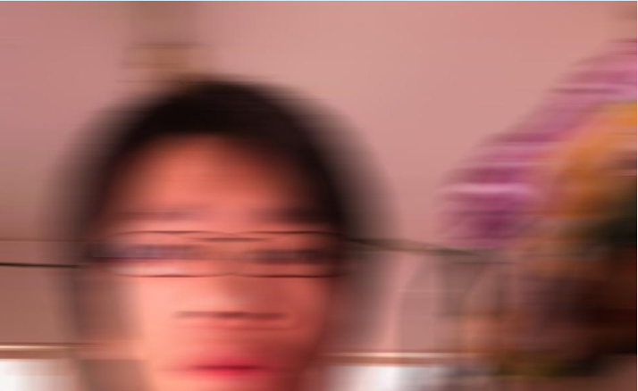

# wxpython 的笔记

## 图像id

这个只能通过图像加入（add）`ImageList`时获得。控件需要拥有一个`ImageList`（AssignImageList）。

#### 关键字

`ImageList` `Image` `index` `AssignImageList` `WithImages`  `Alpha Channel`

#### 例子

```python
import os

import wx

path = "test.jpg"
image = wx.Image(path)

class ToolBook(wx.Toolbook):
    u"""此处应有文档
    """
    def __init__(self, parent, id, style=wx.TB_BOTTOM):
        super(ToolBook, self).__init__(parent, id, style)

        imagelist = wx.ImageList(75, 75) # (weight, height)

        index_1 = imagelist.Add(wx.Image(path_1).ConvertToBitmap())
        index_2 = imagelist.Add(wx.Image(path_2).ConvertToBitmap()) 
        index_3 = imagelist.Add(wx.Image(path_3).ConvertToBitmap()) 

        self.AssignImageList(imagelist)

        p = wx.Panel(self, -1)
        win = ColorPanel.ColoredPanel(p, "red")
        p.win = win
        self.AddPage(p, "string", index_1)
        self.AddPage(p, "string", index_2)
        self.AddPage(p, "string", index_3)

        # 事件处理
        self.Bind(wx.EVT_TOOLBOOK_PAGE_CHANGED, self.OnPageChanged)
        self.Bind(wx.EVT_TOOLBOOK_PAGE_CHANGING, self.OnPageChanging)

    def OnPageChanged(self, event):
        old = event.GetOldSelection()
        new = event.GetNewSelection()
        sel = self.GetSelection()

    def OnPageChanging(self, event):
        old = event.GetOldSelection()
        new = event.GetNewSelection()
        sel = self.GetSelection()

```
#### ImageList

- 初始化时需要指定图像的大小，一般来说二维的大小都是（宽， 高）。`mask`用于`transparent drawing`。

`ImageList(width, height, mask=True, initialCount=1)`

- 以列表的形式储存图像，储存形式没有指定。可以包含`bitmap`和`icon`两种格式。`icon`只能在`MSW`和`MAC OS`上能用。

- `ListCtrl`和`TreeCtrl`有关。

使用`Add(bitmap, mask=True)`会返回添加图像在`ImageList`中的索引。原图像并不会被被这里的操作所影响。
如果`bitmap`比规定的尺寸要大的话，会被切割成符合规定的。`icon`则不会。

	add()

##### WithImages

是一个`mixin`类，用于使用`ImageList`的其他类。为其他类使用`ImageList`做准备。

子类有`BookCtrlBase`。

有三个重要的方法：

- `AssignImageList(self, ImageList)`:为`Page Control`设置ImageList并且移交所有权给它（垃圾回收）。 
- `SetImageList(self, ImageList)`:设置但不移交所有权，需要自己删除列表。
- `GetImageList(self)`:返回关联的ImageList，没有则为`None`。

#### wx.Image 与 wx.Bitmap 的区别

wx.Image是用来执行各种操作的，例如：剪切、旋转、缩放等。与平台无关。暂时不可以画在设备上下文上。

wx.Bitmap可以简单快速的画在各种设备上下文上。

```python
```

## `Mixin`是什么意思？

面向对象语言里的一个编程概念，用于给其他类提供额外的功能而不增加其负担。向其他类注入代码。

以父类的方式只提供功能，不创建隔离，特殊化。

- 给多个不同类别的类添加相同的功能。
- 代码重用
- 以组合的方式创建类

<a target="blank" href="https://en.wikipedia.org/wiki/Mixin">维基百科</a>

#### 常见问题

Python类的多重继承，使得`mixin`的创建成为可能。Python的继承方式是<i style="color:red">从右到左</i>，左面的方法会覆盖右边的。不注意就会出错。

从右到左意味着最右边的类是基类，左边的类是用来给他提供扩展的。

```python
class Mixin1(object):
	def some_functions():
		print u"Mixin1 exist to extend main class"

class Mixin2(object):
	def some_functions():
		print u"Mixin2 exist to extend main class"

class BaseClass(object):
	def main_functions():
		print u"Main function"

class MoreFunction(Mixin2, Mixin1, BaseClass): # 专业的BaseClass在最右边
	def addition_function():
		print "addtion function"
```
<a target="blank" href="https://www.ianlewis.org/en/mixins-and-python">来自：www.ianlewis.org</a>

## wx.Toolbook

## 图像处理中的`mask` `Alpha Channel`是什么意思？

wx.Image 支持`PNG` `TGA` `TIFF`三种格式图像的Alpha Channel

## wx.Image

GIF, ICO and TIFF 一个文件可能包含多张图片，需要指定图片的索引。

### 创建 保存

```python
# 从文件
image = wx.Image("path/to/image")
# 从流
img = wx.Image(stream, type=BITMAP_TYPE_ANY, index=-1)

# 保存
image.SaveFile(name, type) # name 是文件名包含路径 c://wx/abc.jpg 可以不指定type
image.SaveFile(stream, type) # 保存到输出流 type必须指定
```

#### 支持图像格式 type的值

|格式|type值|备注|
|----|---|----|
||wx.BITMAP_TYPE_INVALID	 ||
|bmp|wx.BITMAP_TYPE_BMP	 ||
|ico|wx.BITMAP_TYPE_ICO	 ||
|cur|wx.BITMAP_TYPE_CUR	 |Windows鼠标文件|
|xbm|wx.BITMAP_TYPE_XBM	 ||
|xbm_data|wx.BITMAP_TYPE_XBM_DATA	 ||
|xpm|wx.BITMAP_TYPE_XPM	 ||
|xpm_data|wx.BITMAP_TYPE_XPM_DATA	 ||
|tiff|wx.BITMAP_TYPE_TIFF	 ||
|tif|wx.BITMAP_TYPE_TIF	 ||
|gif|wx.BITMAP_TYPE_GIF	 ||
|png|wx.BITMAP_TYPE_PNG	 ||
|jpeg|wx.BITMAP_TYPE_JPEG	 ||
|pnm|wx.BITMAP_TYPE_PNM	 ||
|pcx|wx.BITMAP_TYPE_PCX	 ||
|pict|wx.BITMAP_TYPE_PICT	 ||
|icon|wx.BITMAP_TYPE_ICON	 |使用SaveFile时储存的是Windows的图标文件|
|ani|wx.BITMAP_TYPE_ANI	 |Windows Animated cursor file|
|iff|wx.BITMAP_TYPE_IFF	 ||
|tga|wx.BITMAP_TYPE_TGA	 ||
|mac cursor|wx.BITMAP_TYPE_MACCURSOR	 ||
|any|wx.BITMAP_TYPE_ANY|自动检测格式|

### 像素处理

`monochrome`:单

`black`:黑色

`white`:白色


#### 模糊 blur

`Blur(self, blurRadius)` 半径以像素（pixel）为单位，进行垂直、水平方向模糊处理。

</img>
</img>
</img>

`BlurHorizontal(self, BlurRadius)`只在水平方向进行。

</img>
</img>
</img>


`BlurVertical(self, blurRadius)` 只在垂直方向进行。

</img>
</img>
</img>

#### 转换成 Bitmap

	ConvertToBitmap(self, depth=-1)

#### 调整亮度

	ConvertToDisabled(self, brightness=255)

转换后</img> 
原图</img>

#### 调整灰阶（Greyscale）

	ConvertToGreyscale(self)
	ConvertToGreyscale(self, weight_r, weight_g, weight_b)

</img>
</img>

#### 单色图像(mono:单)

图像中的`(r, g, b)`变成白色。其他变为黑色。

	ConvertToMono(self, r, g, b)
	ConvertToMonoBitmap(self, r, g, b)

</img>
</img>
